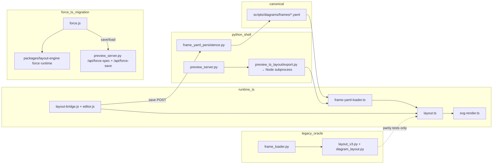

# diagram-generator — repo health audit

**Date:** 2026-06-05  
**Scope:** Read-only architecture, staleness, and drift audit  
**Benchmark:** reference/verbal description → frame YAML → TypeScript generates editable SVG in the browser editor

---

## TL;DR

The **v3 autolayout path matches the intended architecture**: frame YAML is canonical, preview/layout/SVG run through TypeScript (`packages/layout-engine/`), interactive relayout is client-side, and saves flatten back into YAML. JSON sidecars and `localStorage` are not diagram authorities.

The repo is mid-migration: ~4,500 lines of Python layout oracle remain for parity, dual YAML parsers exist, and docs/skills still reference stale pipelines. Architecture is **directionally solid** (spec-kit, TS-first mandate) but carries **three eras** — current v3, Python oracle + draw.io, and an older force-layout migration that has since been resolved under the TS runtime.

**Single biggest gap at audit time:** the force-layout editor was non-functional. The deleted Python backend and tracked example specs were gone while the client shell remained. That gap has since been closed with a TypeScript-owned force lane.

---

## Priority: restore force layout (TypeScript)

> **Historical note.** At audit time the force-layout lane was broken. It has since been reimplemented following the repo's TS-first rule.

### Current state at audit time (superseded)

| Component | Status |
|-----------|--------|
| `scripts/preview/force.js` (~1,207 lines) | **Present** — client UI, simulation controls, pin/drag, export hooks |
| `scripts/preview/force-viewer.html` | **Present** — BF-shell viewer template |
| `scripts/preview_server.py` force routes | **Present but unavailable** — legacy routes remained, but no working backend existed |
| Deleted Python force backend | **Gone** — server-side state wrapper and solver had been removed |
| TS force benchmark | **Needed** — package-level benchmark was not yet the sole entrypoint |
| `scripts/diagrams/force/*.json` | **Deleted** — example specs no longer in repo |
| `diagrams/1.input/force/` reference images | **Present** — `IMG_3229.jpg`, `IMG_3231.jpg`, `IMG_3232.jpg` still exist |

At audit time the force lane was unavailable on demand: force example discovery returned `[]`, the root index omitted the force section, and direct force endpoints needed either explicit unavailability handling or a restored backend.

### Examples we had (must surface again)

These three examples were tracked, validated, and demo-ready (see `docs/archive/history-2026-05.md`):

| Slug | Source reference | What it demonstrated |
|------|------------------|----------------------|
| `force-stakeholders` | `diagrams/1.input/force/IMG_3229.jpg` | First force prototype; stakeholder relationship graph |
| `force-juju-landing-pages` | `diagrams/1.input/force/IMG_3231.jpg` | Larger graph; 320-tick settle bounds check |
| `force-support-case-lifecycle` | `diagrams/1.input/force/IMG_3232.jpg` | Support lifecycle force diagram |

Each had a JSON spec under `scripts/diagrams/force/<slug>.json` (nodes, links, styles, overrides). Those files are **no longer in the tree**. The three reference input images still exist under `diagrams/1.input/force/`.

**Previously working behaviour** (to restore):

- `/force/view/<slug>` in the BF preview shell with shared prev/next nav
- Drag-to-pin manual placement; TS-backed pin/style updates
- Simulation tick API; Reset reloads the TS runtime around pinned state
- Save persists across server restarts; JSON + SVG export
- 8-handle resize on selected nodes (48px minimum), snapped to 8px grid

### Required direction: TypeScript, not Python

Per `.github/copilot-instructions.md`, **all new layout and simulation work is TypeScript**. Do not reintroduce a Python force backend.

Recommended restoration shape:

1. **Force spec format** — define a canonical JSON or YAML schema for force graphs (nodes, links, pins, styles). Store examples under `scripts/diagrams/force/` again (or migrate to YAML if aligned with frame YAML conventions).
2. **TS force solver** — port the simulation to `packages/layout-engine/` or a sibling `packages/force-engine/` module (d3-force-style forces: center, collide-rect, link, many-body). Run in browser for interactive tick; optional Node batch for export.
3. **Wire `force.js`** — replace `/api/force/*` Python round-trips with either client-side-only simulation or thin TS subprocess endpoints (same pattern as `preview_ts_layout.py`).
4. **Restore the three examples** — reconstruct `force-stakeholders`, `force-juju-landing-pages`, and `force-support-case-lifecycle` from archive history and any remaining git history; wire them back to the existing reference images in `diagrams/1.input/force/`.
5. **Preview server cleanup** — remove dead force-backend paths and keep the benchmark directly on the TS solver.
6. **Index surfacing** — force demos should appear on `/` and in the diagram picker alongside v3 autolayout slugs.

**Tier:** `[H]` — architectural decision (spec format, package boundary) plus example reconstruction.

---

## Intended vs actual architecture

### What works as designed (v3)

| Step | Implementation |
|------|----------------|
| Authoring | 19 frame YAML files in `scripts/diagrams/frames/` |
| Load | TS `frame-yaml-loader.ts` → JSON DTO via `emit-frame-diagram-json.mjs` |
| Layout + measure | TS `packages/layout-engine/` (HarfBuzz in browser) |
| Live SVG | TS `export-frame-svg.mjs` via `preview_ts_export.py` pool |
| Interactive edit | `layout-bridge.js` — no server relayout round-trip |
| Persist | `POST /api/overrides/<slug>` → `frame_yaml_persistence.py` → in-place YAML rewrite |

### Where v3 diverges from "TS only"

- Python **hosts** the preview server, YAML save projection, and Node subprocess orchestration (~1,365 lines in `preview_server.py`).
- A large **Python layout mirror** remains for parity tests, not the live editor.
- **draw.io** is a parallel Python pipeline (`export_drawio_batch.py`, ~1,588 lines).
- **Force layout** — client shell exists; entire backend and examples deleted (see priority section above).

---

## Legacy & double-work inventory

| Location | What it does | Still needed? | Severity |
|----------|--------------|---------------|----------|
| `scripts/layout_v3.py` (~2,094 lines) | Python layout engine | Parity oracle only | **Moderate** — retire or shrink |
| `scripts/diagram_layout.py` (~2,384 lines) | Primitive types for Python layout | `layout_v3.py` + tests only | **Moderate** |
| `scripts/frame_loader.py` (~496 lines) | Python YAML parser | Not on live path; mirrored by TS | **Moderate** |
| `scripts/test_parity.py` | Cross-lang coordinate parity | **Stale** — wrong heading/body model | **Low** — retire or realign |
| `parity.test.ts` + `parity-fixtures.json` | TS fixture parity | Yes; **12 known failures** on `test-deep-nesting` | **Moderate** |
| `test_style_parity.py` + fixtures | Style resolver parity | Intentional cross-lang contract | **Low** |
| `frame_yaml_persistence.py` | YAML save + style map | Yes; duplicates editor/TS semantics | **Moderate** |
| `export_drawio_batch.py` | Batch draw.io XML | Separate deliverable lane | **Low** if draw.io stays |
| `docs/diagram-schema.json` | Legacy v2-ish schema | Historical | **Low** — archive |
| Prebuilt SVG under `diagrams/2.output/` | Fallback when live TS fails | Can mask regressions | **Moderate** |
| `force.js` + broken force API | Force editor | **Must restore in TS** | **High** |
| Spec 008 Phase 5 (TODO T043–T047) | Port resolved-style to Python | Planned continued double work | **Moderate** — reconsider |

**Double work verdict:** intentional migration scaffolding on the v3 path. Python duplication is not runtime parity for the live editor — except where spec 008 Phase 5 would extend the mirror again. Force layout should **not** add a third Python stack; rebuild in TS only.

---

## Sources of truth

| Data | Canonical | Derived / ephemeral | Conflict risk |
|------|-----------|---------------------|---------------|
| Diagram structure & layout | `scripts/diagrams/frames/<slug>.yaml` | — | Low if users Save before agent YAML edits |
| Frame tree for editor | YAML → TS loader | `/api/frame-tree/<slug>` JSON | Low — derived DTO |
| Component tree / grid | TS layout output | `/api/tree/`, `/api/grid/` | Low — recomputable |
| In-session inspector edits | `component-model.js` overrides | Until Save | Medium |
| Runtime coercion | Not persisted | `editor.js` | Low |
| Shell panel width | In-memory `volatileShellWidthState` | Not `localStorage` | None for diagram content |
| JSON sidecars | **Removed** | — | None |
| `localStorage` (diagram state) | **None** | — | None |
| draw.io exports | Checked-in artifacts | `diagrams/2.output/draw.io/` | **High** vs YAML if hand-edited |
| Force graph state | **Was** JSON under `scripts/diagrams/force/` | **Gone** | N/A until restored |

Save path is clean for v3: `editor.js` → `POST /api/overrides/` → YAML rewrite → TS cache invalidation. No JSON sidecar authority.

---

## Staleness & doc drift

| Artifact | Issue |
|----------|-------|
| `docs/architecture-status.md` | Claims **32** YAML diagrams (actual **19**); **240** vitest tests (`STATUS.md` says **241**) |
| `docs/architecture/layout-grid.md` | Still documents `tmp/overrides/<slug>.json` sidecar persistence |
| `preview_server.py:771` | References deleted `build_v2.py` |
| `docs/architecture/repo-convergence-audit-2026-06-01.md` | Historical — Python bootstrap claims superseded by specs 012/013 |
| `.github/skills/diagram-build-validate/SKILL.md` | Gates on full Python parity pytest despite acknowledged stale failures |
| `TODO.md` | Force work only as low-priority items; **no tracked `[H]` item to restore force lane** |

---

## Strengths

1. Clear north star — YAML in, TS layout/SVG out, browser editor (`copilot-instructions.md`, specs 011–021).
2. Live v3 path converged — `diagram_render_svg.py` removed; preview APIs TS-only.
3. Spec-kit discipline — active packages for lean variant authority (020), autolayout hardening (005), coherence (008).
4. Single package boundary — `packages/layout-engine/` ready for `design-foundry` port.
5. Persistence model — in-place YAML save; no sidecar/localStorage for diagram state.
6. Test depth — vitest golden SVG, preview browser regressions, dist auto-rebuild.
7. Workflow honesty — `STATUS.md` / `TODO.md` flag known failures and migration state.

---

## Recommended next moves (ranked)

| # | Move | Why | Tier |
|---|------|-----|------|
| **1** | **Restore force layout in TypeScript** — solver + spec format + three examples + preview routes | Broken demo lane; client shell already exists; must not reintroduce Python backend | `[H]` |
| 2 | Finish **spec 020** — prune corpus, semantic-only YAML | Cuts fixture debt | `[H]` |
| 3 | Retire or quarantine **Python parity** — `test_parity.py`, `layout_v3.py` non-gating; fix 12 `test-deep-nesting` failures | Stops double-maintenance | `[H]` |
| 4 | **Doc hygiene** — fix `layout-grid.md`, `architecture-status.md`, archive `diagram-schema.json` | Prevents agent wrong-paths | `[L]` |
| 5 | Reconsider **spec 008 Phase 5** Python port — TS-only resolved-style tests instead | Avoids extending Python mirror | `[H]` |
| 6 | Decompose **`preview_server.py`** and **`editor.js`** | Reduces accretion | `[S]` |

---

## Alignment checklist

| Question | Answer |
|----------|--------|
| YAML → TS → editable SVG in browser? | **Yes** (v3 autolayout) |
| Python traces remaining? | **Yes** — preview host, YAML save, layout oracle, draw.io |
| Double work for parity? | **Yes, transitional** — shrinking but not done |
| JSON sidecar / localStorage overrides? | **No** for v3 diagram authority |
| Force layout working? | **No** — rebuild in TS; restore three examples |
| Solid or patch-on-patch? | **Solid direction, incomplete execution** |

---

*Generated by `/audit-diagram-generator` session. In-flight work at audit time: `packages/layout-engine/scripts/_dist-import.mjs`, `scripts/test_preview_frames_dir.py`.*
